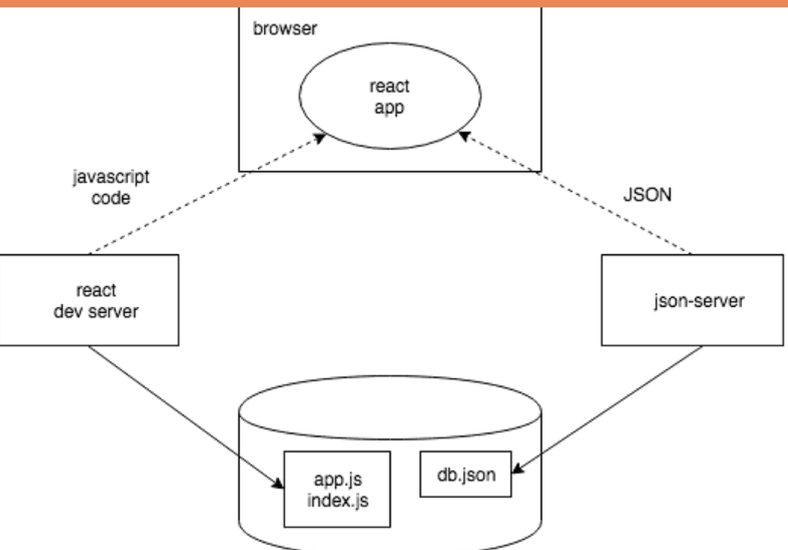

## Topics studied

- Protip: Visual Studio Code snippets
  e.g (
  {
  "console.log": {
  "prefix": "clog",
  "body": [
  "console.log('$1')",
  ],
  "description": "Log output to console"
  }
  }
  )
- JavaScript Arrays
- Event Handlers Revisited
- Rendering Collections
- Key-attribute
- Map
- Anti-pattern: Array Indexes as Keys
- Refactoring Modules
- When the Application Breaks
- Web developer's oath

## Necessary Notes

You can start the JSON Server without a separate installation by running this npx command in the root directory of the application:

- npx json-server --port 3001 db.json

## what is event loop

https://www.youtube.com/watch?v=8aGhZQkoFbQ

## Effect Hooks

- Effects let a component connect to and synchronize with external systems. This includes dealing with network, browser DOM, animations, widgets written using a different UI library, and other non-React code.

## ⚛️ React Component Lifecycle (Simplified)

| Term | When It Happens | What It Means | Typical Example |
|------|-----------------|----------------|-----------------|
| **Render** | Every time React evaluates your component | React calls the component function to generate the virtual DOM (based on current state & props). | Happens on first load and on every state/prop change. |
| **Mounted** | The first time the component is added to the DOM | The JSX is now part of the actual DOM and visible on screen. | `useEffect(() => { ... }, [])` runs right after mounting. |
| **Re-render** | Whenever state or props change | React calls the component function again to update the virtual DOM and reflect new data. | When you call `setState()` or parent passes new props. |
| **Unmounted** | When the component is removed from the DOM | React cleans up event listeners, timers, and effects related to that component. | You can handle cleanup in `useEffect(() => { ...; return () => {...} }, [])`. |

---

## 🧠 Summary

| Phase | What Happens | Can run side effects? |
|--------|---------------|----------------------|
| **Render** | Component function runs → JSX produced | ❌ No |
| **Commit** | DOM updates, component visible | ❌ No |
| **Effect** | `useEffect` callbacks execute | ✅ Yes |
| **Cleanup** | Old effects cleaned before re-running | ✅ Yes |

---

Even though `useEffect` is *inside* the component body, its callback is **deferred until after** React finishes rendering and committing the DOM.

## Development Environment

The JavaScript code making up our React application is run in the browser. The browser gets the JavaScript from the React dev server, which is the application that runs after running the command npm run dev. The dev-server transforms the JavaScript into a format understood by the browser. Among other things, it stitches together JavaScript from different files into one file. We'll discuss the dev-server in more detail in part 7 of the course.

The React application running in the browser fetches the JSON formatted data from json-server running on port 3001 on the machine. The server we query the data from - json-server - gets its data from the file db.json.

At this point in development, all the parts of the application happen to reside on the software developer's machine, otherwise known as localhost. The situation changes when the application is deployed to the internet. 