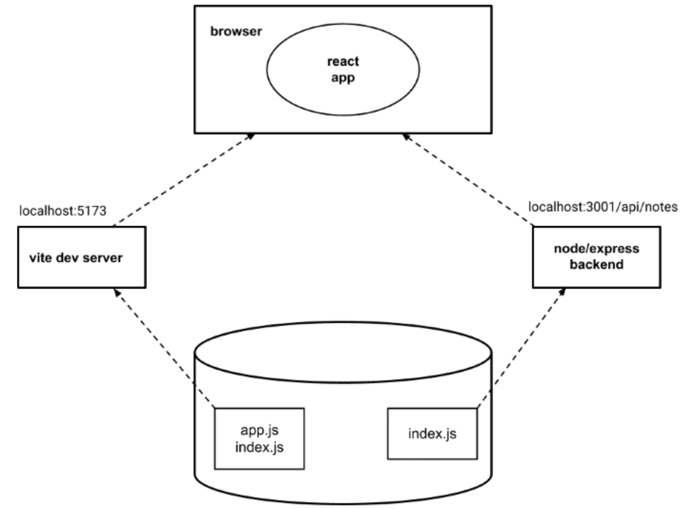

## The Visual Studio Code REST client

you can use the VS Code REST client plugin instead of Postman.
Once the plugin is installed, using it is very simple. We make a directory at the root of the application named requests. We save all the REST client requests in the directory as files that end with the .rest extension.

By clicking the Send Request text, the REST client will execute the HTTP request and the response from the server is opened in the editor.

## why we use json-parser (as in app.use(express.json())) ?
Without the json-parser, the body property would be undefined. The json-parser takes the JSON data of a request, transforms it into a JavaScript object and then attaches it to the body property of the request object before the route handler is called.

## Same origin policy and CORS

* A URL's origin is defined by the combination of protocol (AKA scheme), hostname, and port. e.g:
http://example.com:80/index.html
  
    - protocol: http  
    - host: example.com  
    - port: 80  

* When you visit a website (e.g. http://example.com), the browser issues a request to the server on which the website (example.com) is hosted. The response sent by the server is an HTML file that may contain one or more references to external assets/resources hosted either on the same server that example.com is hosted on or a different website. When the browser sees reference(s) to a URL in the source HTML, it issues a request. If the request is issued using the URL that the source HTML was fetched from, then the browser processes the response without any issues. However, if the resource is fetched using a URL that doesn't share the same origin(scheme, host, port) as the source HTML, the browser will have to check the Access-Control-Allow-origin response header. If it contains * on the URL of the source HTML, the browser will process the response, otherwise the browser will refuse to process it and throws an error.

* The same-origin policy is a security mechanism implemented by browsers in order to prevent session hijacking among other security vulnerabilities.

* In order to enable legitimate cross-origin requests (requests to URLs that don't share the same origin) W3C came up with a mechanism called CORS(Cross-Origin Resource Sharing). According to Wikipedia:
    - Cross-origin resource sharing (CORS) is a mechanism that allows restricted resources (e.g. fonts) on a web page to be requested from another domain outside the domain from which the first resource was served. A web page may freely embed cross-origin images, stylesheets, scripts, iframes, and videos. Certain "cross-domain" requests, notably Ajax requests, are forbidden by default by the same-origin security policy.

 

